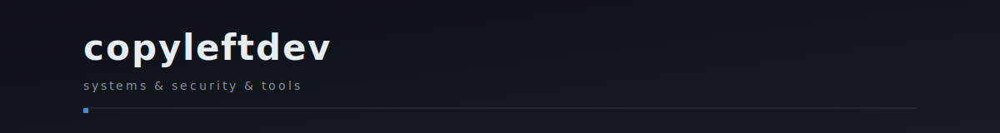

I build distributed systems, developer tools, and infrastructure.  
Currently exploring **Zig**, **WebAssembly**, and **Kubernetes**.

---

#### Stack

```
Languages    Python · TypeScript · Go · Rust · Shell
Infra        AWS · GCP · Docker · Kubernetes · Terraform  
Data         PostgreSQL · Redis · MongoDB
Frameworks   FastAPI · React · Next.js
```

---

#### Featured Work

🔒 **[fatt](https://github.com/copyleftdev/fatt)** — High-performance async security scanner for identifying exposed files across millions of domains. Built in Rust.

🧠 **[sigmos](https://github.com/copyleftdev/sigmos)** — Next-gen DSL for defining AI-native, composable, reactive systems. Rust.

📚 **[vibe-rules-collection](https://github.com/copyleftdev/vibe-rules-collection)** — Curated `.windsurfrules` for AI coding assistants. 40+ forks.

🎯 **[OverHelloWorld](https://github.com/copyleftdev/OverHelloWorld)** — Intentionally over-engineered Hello World in Go. DDD, CQRS, event sourcing, telemetry.

---

#### Recent Activity

<!--START_SECTION:activity-->
<!--END_SECTION:activity-->

---

<sub>**[bwarz.vercel.app](https://bwarz.vercel.app)** · **[don@codetestcode.io](mailto:don@codetestcode.io)** · **[linkedin/copyleftdev](https://linkedin.com/in/copyleftdev)**</sub>
