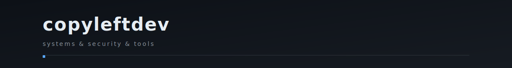

<picture>
  <source media="(prefers-color-scheme: dark)" srcset="assets/header.svg"/>
  <source media="(prefers-color-scheme: light)" srcset="assets/header-light.svg"/>
  
</picture>

> [!NOTE]
> I build sharp, single-purpose tools — mostly in Rust, sometimes in Go or Zig.
> Security scanners, developer utilities, AI infrastructure, and the occasional absurd experiment.
> 560+ public repos. Everything ships.

[gitmesh.app](https://www.gitmesh.app/) · [don@codetestcode.io](mailto:don@codetestcode.io) · [linkedin](https://www.linkedin.com/in/donscv/)

---

## Languages & Tools

<kbd>Rust</kbd> <kbd>Go</kbd> <kbd>Zig</kbd> <kbd>Python</kbd> <kbd>TypeScript</kbd> <kbd>Nim</kbd> <kbd>Shell</kbd> <kbd>Docker</kbd> <kbd>PostgreSQL</kbd> <kbd>Redis</kbd> <kbd>SQLite</kbd>

---

## Selected Repositories

### Security & Offensive

| Repository | Description | Language |
|:-----------|:------------|:--------:|
| [fatt](https://github.com/copyleftdev/fatt) | Distributed async scanner for exposed files across millions of domains | $\texttt{Rust}$ |
| [fuf](https://github.com/copyleftdev/fuf) | Fast next-generation web fuzzer | $\texttt{Rust}$ |
| [blsmesh](https://github.com/copyleftdev/blsmesh) | Distributed adversarial behavioral security evaluation for LLMs | $\texttt{Rust}$ |
| [robin-smesh](https://github.com/copyleftdev/robin-smesh) | Decentralized dark web OSINT framework — Tor crawling, artifact extraction | $\texttt{Rust}$ |
| [thinksec](https://github.com/copyleftdev/thinksec) | Curated collection of security skill files for expert workflows | $\texttt{md}$ |
| [chrono-dance-showcase](https://github.com/copyleftdev/chrono-dance-showcase) | Temporal threat detection engine for security analysts | — |

### Developer Tools

| Repository | Description | Language |
|:-----------|:------------|:--------:|
| [hook-bin](https://github.com/copyleftdev/hook-bin) | Single-binary webhook inbox — embedded SQLite, live dashboard, zero deps | $\texttt{Rust}$ |
| [zgrok](https://github.com/copyleftdev/zgrok) | Self-hosted ngrok alternative built on Tokio | $\texttt{Rust}$ |
| [corey](https://github.com/copyleftdev/corey) | CLI for managing GitHub credentials, secrets, and variables | $\texttt{Zig}$ |
| [print-service-go](https://github.com/copyleftdev/print-service-go) | HTML-to-PDF conversion service with advanced rendering | $\texttt{Go}$ |
| [workflow-showcase](https://github.com/copyleftdev/workflow-showcase) | Minimal app showcasing powerful GitHub Actions CI/CD patterns | $\texttt{YAML}$ |
| [pdfvec](https://github.com/copyleftdev/pdfvec) | High-performance PDF text extraction for vectorization pipelines | — |

### AI & MCP Infrastructure

| Repository | Description | Language |
|:-----------|:------------|:--------:|
| [sigmos](https://github.com/copyleftdev/sigmos) | DSL for defining AI-native, composable, reactive systems | $\texttt{Rust}$ |
| [mcp-flow](https://github.com/copyleftdev/mcp-flow) | WebTransport binding for MCP — QUIC streams, no head-of-line blocking | $\texttt{Multi}$ |
| [nektor](https://github.com/copyleftdev/nektor) | AI-native sampling policy engine for Honeycomb Refinery | $\texttt{Rust}$ |
| [polymcp](https://github.com/copyleftdev/polymcp) | MCP server for the Polygon.io financial data API | $\texttt{Rust}$ |
| [sk1llz](https://github.com/copyleftdev/sk1llz) | Legendary engineer philosophies encoded as Anthropic-compatible Skills | $\texttt{md}$ |

### Languages, Formats & Education

| Repository | Description | Language |
|:-----------|:------------|:--------:|
| [humanlang](https://github.com/copyleftdev/humanlang) | Token bucket rate limiter implemented in 37 languages (1957–2016) | $\texttt{Multi}$ |
| [gen3s1s](https://github.com/copyleftdev/gen3s1s) | Synthetic world generator compiled from declarative Genesis files | $\texttt{Rust}$ |
| [kirsch](https://github.com/copyleftdev/kirsch) | Content fingerprinting & provenance engine — CLIP ViT-B/32, ONNX | $\texttt{Rust}$ |
| [nimtrace](https://github.com/copyleftdev/nimtrace) | Zero-cost structured tracing framework for Nim | $\texttt{Nim}$ |
| [toon-zig](https://github.com/copyleftdev/toon-zig) | TOON (Token-Oriented Object Notation) — 30-60% token reduction for LLMs | $\texttt{Zig}$ |
| [gitfoo_episode_1](https://github.com/copyleftdev/gitfoo_episode_1) | Git Black Belt Masterclass — the other 90% of git most devs never use | $\texttt{Python}$ |
| [OverHelloWorld](https://github.com/copyleftdev/OverHelloWorld) | Intentionally over-engineered Hello World — DDD, CQRS, event sourcing, telemetry | $\texttt{Go}$ |
| [vibe-rules-collection](https://github.com/copyleftdev/vibe-rules-collection) | Curated rules for AI coding assistants[^1] | $\texttt{md}$ |

[^1]: 45 stars — the most-starred original repo in the collection.

---

