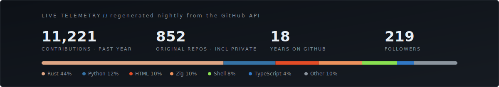

<picture>
  <source media="(prefers-color-scheme: dark)" srcset="assets/header.svg"/>
  <source media="(prefers-color-scheme: light)" srcset="assets/header-light.svg"/>
  
</picture>

> [!NOTE]
> I build sharp, single-purpose tools — mostly in Rust and Zig, sometimes in Go or Python.
> Security scanners, developer utilities, AI infrastructure, and the occasional absurd experiment.
> On GitHub since 2008. Everything ships.

[gitmesh.app](https://www.gitmesh.app/) · [don@codetestcode.io](mailto:don@codetestcode.io) · [linkedin](https://www.linkedin.com/in/donscv/)

---

## About

I'm a systems-level software engineer focused on security tooling, developer infrastructure, and AI-native systems.
Most of my work lives at the intersection of offensive security, protocol engineering, and CLI design — shipping single-binary tools with minimal dependencies that solve one problem well.

- **Security research** — network beacon detection, distributed scanners, web fuzzers, OSINT frameworks, and supply-chain forensics
- **Developer tools** — self-hosted tunnel servers, webhook inspectors, deterministic crawlers, and CI/CD automation
- **AI infrastructure** — Model Context Protocol (MCP) servers, multi-agent coordination protocols, and DSLs for composable AI systems
- **Systems programming** — Rust-first, with production work in Zig, Go, Python, TypeScript, and Nim
- **Open source** — 40+ original public tools, all designed to be auditable and forkable

I care about software that is small, correct, and observable. If it can't be deployed with `scp` and run without a runtime, it's probably too complicated.

---

## Languages & Tools

<kbd>Rust</kbd> <kbd>Zig</kbd> <kbd>Go</kbd> <kbd>Python</kbd> <kbd>TypeScript</kbd> <kbd>Nim</kbd> <kbd>Shell</kbd> <kbd>Docker</kbd> <kbd>PostgreSQL</kbd> <kbd>Redis</kbd> <kbd>SQLite</kbd>

<picture>
  <source media="(prefers-color-scheme: dark)" srcset="assets/metrics.svg"/>
  <source media="(prefers-color-scheme: light)" srcset="assets/metrics-light.svg"/>
  
</picture>

---

## Recently Shipped

<!--RECENT:START-->
| Repository | Description | Lang | Last push |
|:-----------|:------------|:----:|:----------|
| [leet-index](https://github.com/copyleftdev/leet-index) | super top secret | $\texttt{JavaScript}$ | 2026-07-16 |
| [invariantd-site](https://github.com/copyleftdev/invariantd-site) | Marketing site for invariantd.com — video-first landing | $\texttt{HTML}$ | 2026-07-15 |
| [kilo-data](https://github.com/copyleftdev/kilo-data) | Open threat-intelligence and IP-reputation ETL for phishing and abuse screening, with BGP and… | $\texttt{Rust}$ | 2026-07-15 |
| [pipeflow](https://github.com/copyleftdev/pipeflow) | — | $\texttt{Python}$ | 2026-07-14 |
| [kilocheck](https://github.com/copyleftdev/kilocheck) | Local-first deterministic IP intelligence CLI with auditable evidence and policy-grade JSON | $\texttt{Rust}$ | 2026-07-13 |
| [claimzen-site](https://github.com/copyleftdev/claimzen-site) | ClaimZen — evidence-backed denial recovery. Marketing site. | $\texttt{HTML}$ | 2026-07-13 |
<!--RECENT:END-->

This section and the metrics panel above are regenerated nightly by [a stdlib-only Python script](scripts/generate_profile.py) querying the GitHub API — no third-party stats services, nothing to go stale.

---

## Selected Repositories

### Security & Detection

| Repository | Description | Language |
|:-----------|:------------|:--------:|
| [floq](https://github.com/copyleftdev/floq) | C2 beacon detection via Floquet spectral analysis — pcap, live capture, or OTLP; 274 KB binary | $\texttt{Zig}$ |
| [anomalyx](https://github.com/copyleftdev/anomalyx) | Contract-first anomaly detection across ~30 formats — logs, pcap, OTLP; deterministic CLI | $\texttt{Rust}$ |
| [fatt](https://github.com/copyleftdev/fatt) | Distributed async scanner for exposed files across millions of domains | $\texttt{Rust}$ |
| [fuf](https://github.com/copyleftdev/fuf) | Fast next-generation web fuzzer | $\texttt{Rust}$ |
| [robin-smesh](https://github.com/copyleftdev/robin-smesh) | Decentralized dark web OSINT framework — Tor crawling, artifact extraction | $\texttt{Rust}$ |
| [mini-shai-hulud-dragnet](https://github.com/copyleftdev/mini-shai-hulud-dragnet) | Forensic dataset + live dashboard for the 2026 npm supply-chain worm — 1,117 dropbox repos, 47 IOCs | $\texttt{Shell}$ |

### Systems & Developer Tools

| Repository | Description | Language |
|:-----------|:------------|:--------:|
| [tailx](https://github.com/copyleftdev/tailx) | Live system cognition engine — `tail` reimagined: anomalies, traces, structured JSON; 144 KB | $\texttt{Zig}$ |
| [coelacanth](https://github.com/copyleftdev/coelacanth) | AI-first Unix primitives, clean-room reimplemented under one machine-checkable contract | $\texttt{Zig}$ |
| [palimpsest](https://github.com/copyleftdev/palimpsest) | Deterministic crawl kernel — same seed, identical crawl; JA3/JA4 impersonation, WARC++ | $\texttt{Rust}$ |
| [hook-bin](https://github.com/copyleftdev/hook-bin) | Single-binary webhook inbox — embedded SQLite, live dashboard, zero deps | $\texttt{Rust}$ |
| [zgrok](https://github.com/copyleftdev/zgrok) | Self-hosted ngrok alternative built on Tokio | $\texttt{Rust}$ |
| [cora](https://github.com/copyleftdev/cora) | Multi-pattern fixed-string matcher — Aho-Corasick + SIMD on mmap'd files, NDJSON output | $\texttt{Rust}$ |

### AI & Agent Infrastructure

| Repository | Description | Language |
|:-----------|:------------|:--------:|
| [smesh-rust](https://github.com/copyleftdev/smesh-rust) | Decentralized coordination protocol for multi-agent LLM systems — QUIC P2P, sub-µs signal diffusion | $\texttt{Rust}$ |
| [vajra](https://github.com/copyleftdev/vajra) | Deterministic semantic reduction engine for structured data — break noise, preserve truth | $\texttt{Rust}$ |
| [agent-calc](https://github.com/copyleftdev/agent-calc) | AI-native exact calculator — typed JSON math, symbolic reasoning, mutation-tested | $\texttt{Rust}$ |
| [sigmos](https://github.com/copyleftdev/sigmos) | DSL for defining AI-native, composable, reactive systems | $\texttt{Rust}$ |
| [mcp-flow](https://github.com/copyleftdev/mcp-flow) | WebTransport binding for MCP — QUIC streams, no head-of-line blocking | $\texttt{Multi}$ |
| [toon-zig](https://github.com/copyleftdev/toon-zig) | TOON (Token-Oriented Object Notation) — 30–60% token reduction for LLMs | $\texttt{Zig}$ |

### Education & the Absurd

| Repository | Description | Language |
|:-----------|:------------|:--------:|
| [humanlang](https://github.com/copyleftdev/humanlang) | Token bucket rate limiter implemented in 37 languages (1957–2016) | $\texttt{Multi}$ |
| [git-archaeology-lab](https://github.com/copyleftdev/git-archaeology-lab) | Hands-on exercises for forgotten git commands — crafted history, real bugs, real bisect targets | $\texttt{Shell}$ |
| [gitfoo_episode_1](https://github.com/copyleftdev/gitfoo_episode_1) | Git Black Belt Masterclass — the other 90% of git most devs never use | $\texttt{Python}$ |
| [OverHelloWorld](https://github.com/copyleftdev/OverHelloWorld) | Intentionally over-engineered Hello World — DDD, CQRS, event sourcing, telemetry | $\texttt{Go}$ |
| [fafoaas](https://github.com/copyleftdev/fafoaas) | FAFO as a Service — spec-first engineering masterclass; AsyncAPI 3 + MCP, 98/98 mutation score | $\texttt{TS}$ |
| [tip-to-tip-efficiency](https://github.com/copyleftdev/tip-to-tip-efficiency) | Mathematically serious crate for a deeply unserious Silicon Valley efficiency empire | $\texttt{Rust}$ |

---

<a href="https://gitroll.io/profile/uB8fjxzB4NHUkjkK1pggNJbWLqz93">
  <picture>
    <source media="(prefers-color-scheme: dark)" srcset="https://gitroll.io/api/badges/profiles/v1/uB8fjxzB4NHUkjkK1pggNJbWLqz93?theme=dark"/>
    
  </picture>
</a>

<picture>
  <source media="(prefers-color-scheme: dark)" srcset="https://raw.githubusercontent.com/copyleftdev/copyleftdev/output/github-snake-dark.svg"/>
  
</picture>
